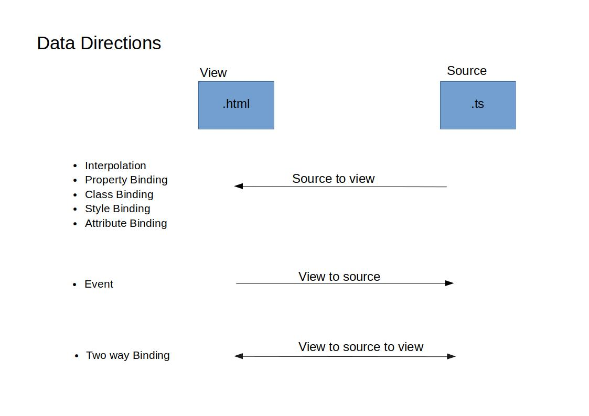

# Template

Template is a combination of original html with angular directive and binding markup

---

## Some Basic Concept of Template

1. [HTML in template](#html-in-template)
2. [Data Binding](#data-binding)
3. [__Binding types__](#Binding-types)
4. [Template Expression](../Angular6-code/Component_And_Template/Interpolation/README.md#template-expression)
5. [Template Statement](../Angular6-code/Component_And_Template/Event-Binding/README.md#template-statement)
6. Template Reference Variable. ( #var )
7. [Template Input Variable.](../Angular6-code/Directives/Structure-Directives/NgForOf.md#template-input-variable)
8. [Input and Output properties](./Input_and_Output_Properties.md) (@Input and @Output)
9. Template Expression operator.
    - The Pipe Operator.  ( | )
    - The safe navigation operator ( ?. )
    - Non-Null sssertion operator ( !. )
    - $any type cast function.
10. [Directives](./Directives.md)

---

## HTML in template

- HTML is language of the Angular template.
- Almost all the HTML syntax is valid except `<srcit>` tag.
- `<html> <body> <base>` have no useful role.

---

## Data Binding

- **Binding data source(component) and view target(HTML).**

## Binding Types

Binding types can be grouped into three categories distinguished by the direction of data flow:

1. Source To View
    - [Interpolation](../Angular6-code/Component_And_Template/Interpolation/README.md)
    - [Property Binding](../Angular6-code/Component_And_Template/Property-Binding/README.md)
    - [Class Binding](../Angular6-code/Component_And_Template/Class-Binding/README.md)
    - [Style Binding](../Angular6-code/Component_And_Template/Style-Binding/README.md)
    - Attribute Binding

2. View To Source
    - [Event Binding](../Angular6-code/Component_And_Template/Event-Binding/README.md)

3. View To Source To View
    - [Two Way Binding](../Angular6-code/Component_And_Template/Two-Way-Binding/README.md)

---